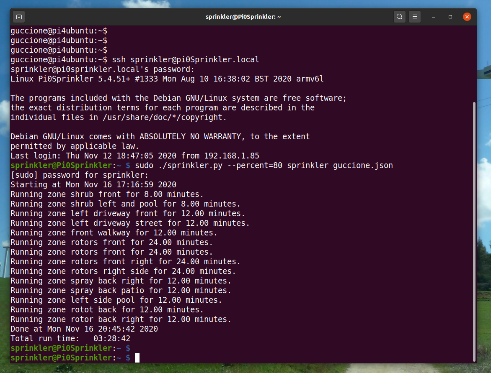

# Sprinkler
Raspberry Pi Zero Sprinkler Controller

This Raspberry Pi Zero based Sprikler controller is a simple GPIO based controller with code in python and driven by a JSON file.  A list of parts is below:

* [**Raspberry Pi Zero WH**](https://smile.amazon.com/Raspberry-Pi-Zero-WH-Pre-soldered/dp/B07B8MMD3V/)
* [**SainSmart 16-Channel Relay Module**](https://smile.amazon.com/gp/product/B0057OC66U/)
* [**BeElion 24V AC to 12V DC Convertor**](https://smile.amazon.com/gp/product/B01JD6ASF8/)
* [**Jameco Reliapro MGT2450P Wall Transformer**](https://smile.amazon.com/gp/product/B01N3ALUBS/)

Other useful bits:

* [**Screw Terminal Fuse Holder**](https://smile.amazon.com/gp/product/B072YLL65L/)
* [**Terminal Block Set, 5Pcs 3 Positions 600V 15A Dual Row Screw Terminals Strip**](https://smile.amazon.com/gp/product/B07Y21YYVD/)
* [**Terminal Block Set, 5Pcs 8 Positions 600V 15A Dual Row Screw Terminals Strip**](https://smile.amazon.com/gp/product/B07Y21HB4G/)
* [**20cm Dupont Wire Female to Female Breadboard Jumper Wires**](https://smile.amazon.com/gp/product/B07GCY6CH7/)

# The Design

A 24V AC power supply is used since the sprinkler valves use 24V AC (note AC, not DC).  A convertor is used to convert the 24V AC to 12V DC for the relay board.  This relay board produces 5V DC which can be used to power the Raspberry Pi Zero. GPIO outputs are used to drive the relays.  These can be done using any set of GPIO pins, but they must be consistent with the table in the JSON file.  As it turns out, these 3.3V outputs are not ideal for the expected 5V of the relay board, but the pull down to 0V works.  So the code will pull the GPIO pin low to activate the relay, and then when not is use, the code disable the GPIO pin.

The relays are wired with ground to the normally closed pins, although this is probably not necessary. The normally open pins are set to 24V AC to drive the sprinkler valves.  The relay outputs go to the various sprinkler valves, via the 16 terminal strips, although these could also be wired directly.

It should be noted that this design is simple and general purpose and could be used to control other devices with appropriate changes.

# Help
```
usage: sprinkler.py [-h]
                    [--percent {1-499}]
                    [--silent] [--debug]
                    json

positional arguments:
  json                  JSON configuration file

optional arguments:
  -h, --help            show this help message and exit
  --percent {1-499}     run time percent (default=100,max=500)
  --silent              run silently
  --debug               debug flag

```

# Sample Run



# Hardware Photo


