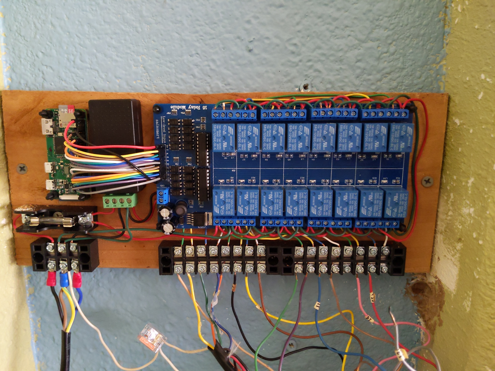

# Sprinkler
Raspberry Pi Zero Sprinkler Controller

This Raspberry Pi Zero based Sprikler controller is a simple GPIO based controller with code in python and driven by a JSON file.  A list of parts is below:

* [**Raspberry Pi Zero WH**](https://smile.amazon.com/Raspberry-Pi-Zero-WH-Pre-soldered/dp/B07B8MMD3V/)
* [**SainSmart 16-Channel Relay Module**](https://smile.amazon.com/gp/product/B0057OC66U/)
* [**BeElion 24V AC to 12V DC Convertor**](https://smile.amazon.com/gp/product/B01JD6ASF8/)
* [**Jameco Reliapro MGT2450P Wall Transformer**](https://smile.amazon.com/gp/product/B01N3ALUBS/)

Other useful bits:

* 

# Help
```
usage: sprinkler.py [-h]
                    [--percent {1-499}]
                    [--silent] [--debug]
                    json

positional arguments:
  json                  JSON configuration file

optional arguments:
  -h, --help            show this help message and exit
  --percent {1-499}     run time percent (default=100,max=500)
  --silent              run silently
  --debug               debug flag

```


